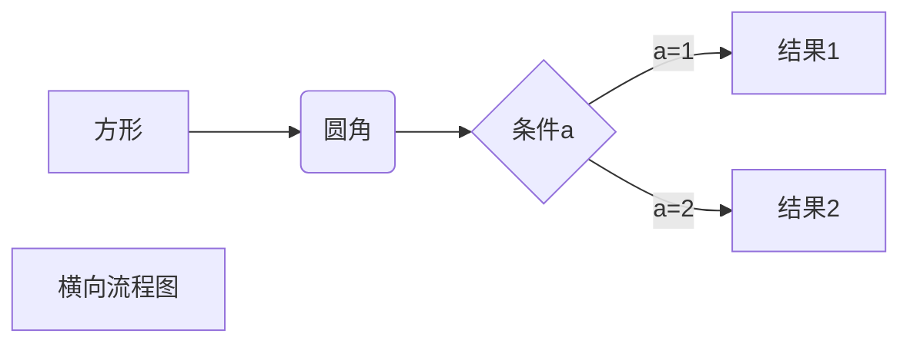
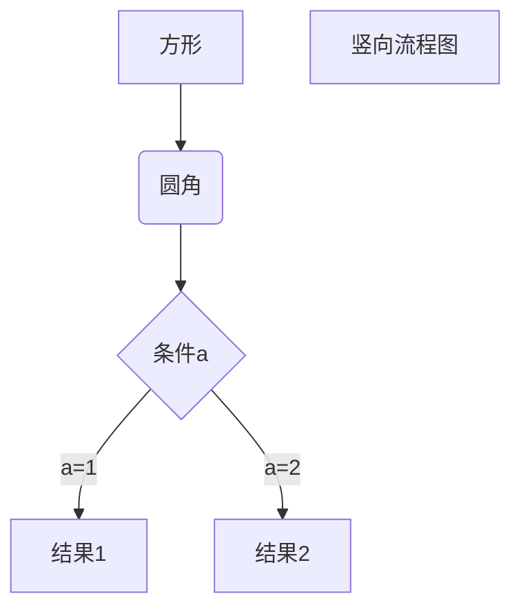
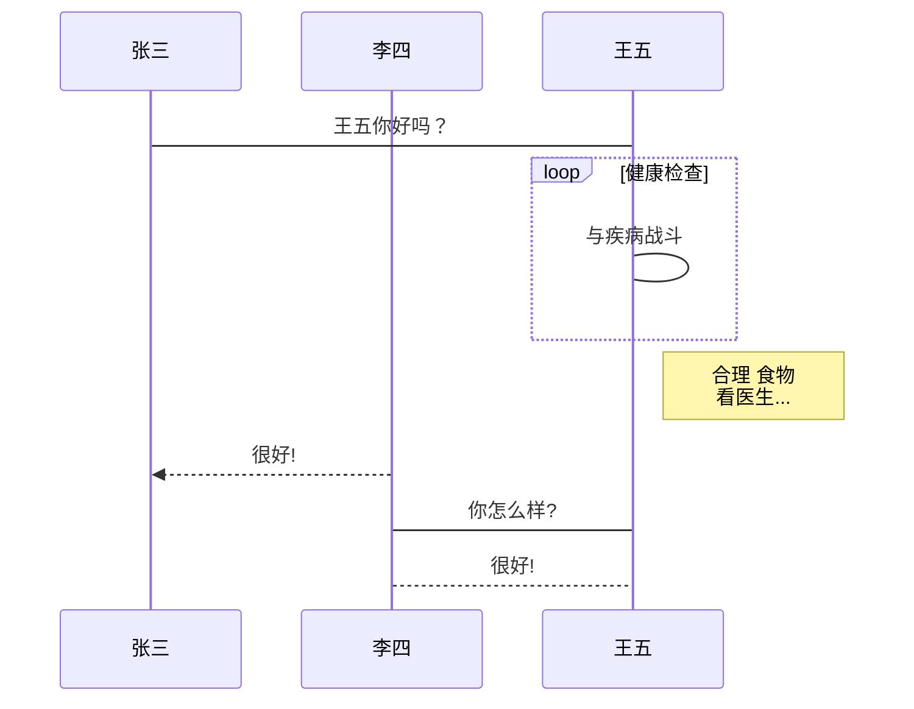
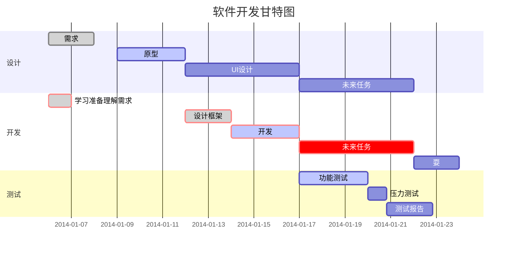

# Markdown笔记
==============================================================

[TOC]
## 标题及目录
---
`#可表示1-6级标题`

在文档开头输入[TOC]可自动生成目录，将以`#`定义的标题编排到目录中
使用 = 标记一级标题

`#一级标题`

=================================================================
使用-标记二级标题
`## 二级`

---
`### 三级`
`#### 四级`
`##### 五级`
`###### 六级`

## 正文
--- 
直接输入

换行时需要在代码中空一行，直接换行无效果

Markdown段落无特殊格式，段落的换行是使用两个以上空格+回车

### 1.字体
*斜体*      `* *`
**粗体**    `** **`
***粗斜体***`*** ***`

### 2.注释符号
`<!-- 需注释的文本-->`

### 3.分隔线
在一行中用三个及以上的星号、减号、底线来建立分隔线。

### 4.删除线
在文字的两端各加两个`~`即可。
~~百度~~  

### 5.下划线
通过HTML的`<u>`标签实现。
`<u>带下划线的文本</u>`
<u>带下划线的文本</u>

### 6.脚注
`[^要注明的文本]`，脚注会自动编号。
创建脚注格式如 [^RUNOOB] 
[^RUNOOB]:菜鸟教程

[^noob]
[^noob]:www.runoob.com

## 列表

### 1.无序列表
使用星号、加号或减号作为列表标记，标记后需添加空格后再填写内容。

### 2.有序列表
使用数字+`.`表示

### 3.列表嵌套
在子列表中的选项前添加两个及以上空格即可。
1.第一项
- 第一项第一个
  1.大苏打
- 第一项第二个

### 4.任务列表
在无序列表`-,*,+`后使用`[]`声明复选框，在中括号中写入`x`,可实现选中效果，`[]`之间只能是`空格`或`x`。

- [ ] Python
- [x] C++

列表文本前添加四个空格或一个tab可对文本进行区块显示。
1.     什么处理

## 区块
在段落开头使用`> + 空格`符号。
> 区块引用

### 1.区块嵌套
几层嵌套就用几个`>`。
> 最外层
>> 第一层嵌套
>>> 第二层嵌套

### 2.区块中使用列表
> 区块1
>- 列表1
>- 列表2
### 3.列表中使用区块
使用`>`添加两个空格
- 第一项
  > 区块1
  > 区块  

使用`1.`时添加四个空格或一个制表符
1. 第一项
    > 区块1
    > 区块 
## 代码
1. 使用四个空格或一个制表符(需与正文隔开一行)
        <?PHP
        echo 'RUNOOB';
        function test(){
            echo 'test';
        }

2. 通过两行```框出，在第一行末尾加相应语言的名字，代码块内的代码将执行对应的高亮语法
    ```python
    print (
        'hello,world!'
    )
    ```

3. 正文中的代码通过``框出  
`show ip interface breif`

## 链接
使用方法:
1. [链接名称](连接地址)
    > 这是一个链接[菜鸟教程](https://www.runoob.com)
2. <链接地址>
    > <https://www.runoob.com>

#### 高级链接
通过变量来设置一个链接，变量赋值在文档末尾进行：
> 这个链接用 1 作为网址变量 [Google][1]
> 这个链接用 runoob 作为网址变量 [Runoob][runoob]
> 然后在文档的结尾为变量赋值
>
> [1]: http://www.google.com
> [runoob]: http://www.runoob.com
## 图片
语法格式：
> 
> 

#### 使图片圆角


代码如下：
<style>
  img {
    border-radius: 50% !important;
    border: 30px solid #eee;
  }
</style>


## 表格
使用`|`来分隔不同的单元格，使用`-`来分隔表头和其他行。
语法格式：
```
    | 表头 | 表头 |
    | --- | --- |
    | 单元格 | 单元格 |
    | 单元格 | 单元格 |
```
效果如下：

| 表头 | 表头 |
| --- | --- |
| 单元格 | 单元格 |
| 单元格 | 单元格 |

可设置表格的对齐方式
1. `-:`：设置内容和标题栏右对齐；
2. `:-`：设置内容和标题栏左对齐；
3. `:-:`：设置内容和标题栏居中对齐。

语法格式：
```
    | 表头 | 表头 | 表头 |
    | ---: | :--- | :---: |
    | 单元格 | 单元格 | 单元格 |
    | 单元格 | 单元格 | 单元格 |
```
效果如下：

| 表头 | 表头 | 表头 |
| ---: | :--- | :---: |
| 单元格 | 单元格 | 单元格 |
| 单元格 | 单元格 | 单元格 |

## HTML元素
不在Markdown涵盖范围内的标签，可直接在文档中用HTML撰写。
常见的HTML元素：

    <kbd>：键盘输入元素；
    <b>：定义粗体的文本；
    <i>：定义与文本中其余部分不同的部分，并把这部分文本呈现为斜体文本；
    <em>：强调元素；
    <sup>：上标元素；
    <sub>：下标文本；
    <br>：标签。


## 转义字符
插入普通符号时需加转义字符`\`。

    \   反斜线
    `   反引号
    *   星号
    _   下划线
    {}  花括号
    []  方括号
    ()  小括号
    #   井字号
    +   加号
    -   减号
    .   英文句点
    !   感叹号

## 公式
Markdown Preview Enhanced使用KateX或MathJax来渲染数学公式。

1. `$...$`或`\(...\)`中的数学表达式将会在行内显示。
2. `$$...$$$`或`\[...\]`或` ```math `中的数学表达式将在块内显示。

示例如下：
$ f(x) = sin(x) +12 $

$$ f(x) = sin(x) +12 $$

### 1.四则运算符
```
    加法符号：$ x + y = z $ 
    减法符号：$ x - y = z $
    加减符号：$ x \pm y = z $
    减加符号：$ x \mp y = z $
    叉乘符号：$ x \times y = z $
    点乘符号：$ x \cdot y = z $
    星乘符号：$ x \ast y = z $
    除法符号：$ x \div y = z $
    斜除符号：$ x / y = z $
    分式1：$ \frac{x + y}{y+z} $
    分式2：$ {x + y} \over {y+z} $
    绝对值：$ |x + y| $
```
示例如下：
    加法符号：$ x + y = z $ 
    减法符号：$ x - y = z $
    加减符号：$ x \pm y = z $
    减加符号：$ x \mp y = z $
    叉乘符号：$ x \times y = z $
    点乘符号：$ x \cdot y = z $
    星乘符号：$ x \ast y = z $
    除法符号：$ x \div y = z $
    斜除符号：$ x / y = z $
    分式1：$ \frac{x + y}{y+z} $
    分式2：$ {x + y} \over {y+z} $
    绝对值：$ |x + y| $
### 2.逻辑运算符
```
    等于符号：$ x + y = z $ 
    大于符号：$ x + y > z $
    小于符号：$ x + y < z $
    大于等于符号：$ x + y \geq z $
    小于等于符号：$ x + y \leq z $
    不等于符号：$ x + y \neq z $
    不大于等于符号：$ x + y \ngeq z $
    不小于等于符号：$ x + y \nleq z $
    约等于符号：$ x + y \approx z $
    恒等于符号：$ x + y \equiv z $
```
示例如下：
    等于符号：$ x + y = z $ 
    大于符号：$ x + y > z $
    小于符号：$ x + y < z $
    大于等于符号：$ x + y \geq z $
    小于等于符号：$ x + y \leq z $
    不等于符号：$ x + y \neq z $
    不大于等于符号：$ x + y \ngeq z $
    不小于等于符号：$ x + y \nleq z $
    约等于符号：$ x + y \approx z $
    恒等于符号：$ x + y \equiv z $

### 3.高等运算符
```
    平均数符号：$ \overline{xyz} $
    开方符号：$ \sqrt x $
    开立方符号：$ \sqrt[3] x $
    对数符号：$ \log(x) $
    极限符号1：$ \lim^{x \to \infty}_{y \to 0}{\frac{x}{y}} $
    极限符号2：$ \displaystyle \lim^{x \to \infty}_{y \to 0}{\frac{x}{y}} $
    求和符号1：$ \sum^{x \to \infty}_{y \to 0}{\frac{x}{y}} $
    求和符号2：$ \displaystyle \sum^{x \to \infty}_{y \to 0}{\frac{x}{y}} $
    积分符号1：$ \int^{\infty}_{0}{xdx} $
    积分符号2：$ \displaystyle \int^{\infty}_{0}{xdx} $
    微分符号：`\partial`
    矩阵符号：$ \left $
```
示例如下：
平均数符号：$ \overline{xyz} $
开方符号：$ \sqrt x $
开立方符号：$ \sqrt[3] x $
对数符号：$ \log(x) $
极限符号1：$ \lim^{x \to \infty}_{y \to 0}{\frac{x}{y}} $
极限符号2：$ \displaystyle \lim^{x \to \infty}_{y \to 0}{\frac{x}{y}} $
求和符号1：$ \sum^{x \to \infty}_{y \to 0}{\frac{x}{y}} $
求和符号2：$ \displaystyle \sum^{x \to \infty}_{y \to 0}{\frac{x}{y}} $
积分符号1：$ \int^{\infty}_{0}{xdx} $
积分符号2：$ \displaystyle \int^{\infty}_{0}{xdx} $
微分符号: $ {\partial x} $
矩阵符号1：$ \left[\begin{matrix} 
                1 & 2 &\cdots & 5 & 6 
            \end{matrix}\right] $
矩阵符号2：$ \begin{Bmatrix}
                1 & 2 &\cdots & 5 & 6
            \end{Bmatrix} $
$$ 
\begin{Bmatrix}
    1 & 2 & 5 & 6 \\
    2 
\end{Bmatrix} \tag{1}
$$
$ \left \{ \right.$
$$
\begin{Bmatrix}
   a & b \\
   c & d
\end{Bmatrix} \tag{2}
$$

### 4.上标、下标
```
    上标符号：$ x^2 $
    下标符号：$ x_2 $
    嵌套符号：$ a^{x^2 + y^2} $
```

上标符号：$ x^2 $
下标符号：$ x_2 $
嵌套符号：$ a^{x^2 + y^2} $

### 5.希腊字母
```
    阿尔法：$ \Alpha $ $ \alpha $
    贝塔：$ \Beta $ $ \beta $
    伽玛：$ \Gamma $ $ \gamma $
    德尔塔：$ \Delta $ $ \delta $
    艾普西龙：$ \Epsilon $ $ \epsilon $
    捷塔：$ \Zeta $ $ \zeta $
    伊塔：$ \Eta $ $ \eta $
    西塔：$ \Theta $ $ \theta $
    拉姆达：$ \Lambda $ $ \lambda $
    缪：$ \Mu $ $ \mu $
    克西：$ \Xi $ $ \xi $
    派：$ \Pi $ $ \pi $
    柔：$ \Rho $ $ \rho $
    西格玛：$ \Sigma $ $ sigma $
    套：$ \Tau $ $ \tau $
    发艾：$ \Phi $ $ \phi $
    普赛：$ \Psi $ $ \psi $
    欧米伽：$ \Omega $ $ \omega $
```
阿尔法：$ \Alpha $ $ \alpha $
贝塔：$ \Beta $ $ \beta $
伽玛：$ \Gamma $ $ \gamma $
德尔塔：$ \Delta $ $ \delta $
艾普西龙：$ \Epsilon $ $ \epsilon $
捷塔：$ \Zeta $ $ \zeta $
伊塔：$ \Eta $ $ \eta $
西塔：$ \Theta $ $ \theta $
拉姆达：$ \Lambda $ $ \lambda $
缪：$ \Mu $ $ \mu $
克西：$ \Xi $ $ \xi $
派：$ \Pi $ $ \pi $
柔：$ \Rho $ $ \rho $
西格玛：$ \Sigma $ $ sigma $
套：$ \Tau $ $ \tau $
发艾：$ \Phi $ $ \phi $
普赛：$ \Psi $ $ \psi $
欧米伽：$ \Omega $ $ \omega $


$$
\begin{CD}
   A @>a>> B \\
@VbVV @AAcA \\
   C @= D
\end{CD}
$$

## 图

### 1.流程图
1. 横向流程图

2. 竖向流程图

3. 标准流程图源码(竖向)
    ```flow
    st=>start: 开始框
    op=>operation: 处理框
    cond=>condition: 判断框(是或否?)
    sub1=>subroutine: 子流程
    io=>inputoutput: 输入输出框
    e=>end: 结束框
    st->op->cond
    cond(yes)->io->e
    cond(no)->sub1(right)->op
    ```
4. 标准流程图源码(横向)
   ```flow
    st=>start: 开始框
    op=>operation: 处理框
    cond=>condition: 判断框(是或否?)
    sub1=>subroutine: 子流程
    io=>inputoutput: 输入输出框
    e=>end: 结束框
    st(right)->op(right)->cond
    cond(yes)->io(bottom)->e
    cond(no)->sub1(right)->op
    ```


### 2.时序图
- 时序图源码
    ```sequence
    对象A->对象B: 对象B你好吗?（请求）
    Note right of 对象B: 对象B的描述
    Note left of 对象A: 对象A的描述(提示)
    对象B-->对象A: 我很好(响应)
    对象A->对象B: 你真的好吗？
    ```
- 复杂样例
    ```sequence
    Title: 标题：复杂使用
    对象A->对象B: 对象B你好吗?（请求）
    Note right of 对象B: 对象B的描述
    Note left of 对象A: 对象A的描述(提示)
    对象B-->对象A: 我很好(响应)
    对象B->小三: 你好吗
    小三-->>对象A: 对象B找我了
    对象A->对象B: 你真的好吗？
    Note over 小三,对象B: 我们是朋友
    participant C
    Note right of C: 没人陪我玩
    ```

### 3.类图

### 4.状态图

### 5.甘特图
```
%% 语法示例
        gantt
        dateFormat  YYYY-MM-DD
        title 软件开发甘特图
        section 设计
        需求                      :done,    des1, 2014-01-06,2014-01-08
        原型                      :active,  des2, 2014-01-09, 3d
        UI设计                     :         des3, after des2, 5d
        未来任务                     :         des4, after des3, 5d
        section 开发
        学习准备理解需求                      :crit, done, 2014-01-06,24h
        设计框架                             :crit, done, after des2, 2d
        开发                                 :crit, active, 3d
        未来任务                              :crit, 5d
        耍                                   :2d
        section 测试
        功能测试                              :active, a1, after des3, 3d
        压力测试                               :after a1  , 20h
        测试报告                               : 48h
```


### 6.饼图

饼图包含[标题]、[内容名称]、[内容权重]三项，[内容权重]会在渲染时自动转换为百分比并显示在饼图上。
```
    pie title 宠物的选择
        "狗"：386
        "猫"：85
        "兔子"：15
```

